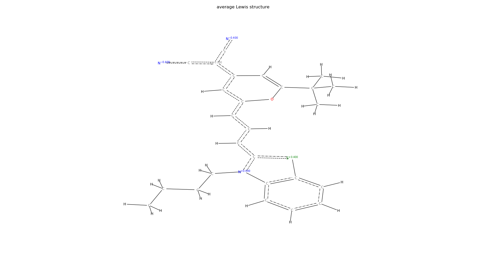

Bond Order Assignment using Linear Programming
----------------------------------------------

One or more valid Lewis structures are determined for a molecule
based only on the elements and atom connectivities.
Bond orders, formal charges and lone electron pairs are assigned
with the help of linear programming [1]_ as described in Froeyen and Herdewijn (2005) [2]_

Requirements
------------

Required python packages:

 * numpy, matplotlib

   
Installation
------------
The package is installed with

.. code-block:: bash

   $ pip install -e .

in the top directory.

Getting Started
---------------

While it is not necessary to use an optimized geometry, all atoms (including hydrogens)
should have reasonable 3D positions, so that it is possible to detect which atoms
are connected based on the distance matrix.

Only the element type and atom connectivities are needed to determine the Lewis structures.
The following example computes the two Lewis structures of benzene:

.. code-block:: python

  from lewis_structures.LewisStructures import lewis_structures
  from lewis_structures.XYZ import read_xyz, connectivity_matrix

  # read molecule from xyz-file and determine atom connectivity
  atomlist = read_xyz('examples/benzene.xyz')[0]
  ConMat = connectivity_matrix(atomlist)

  # maximum recursion depth when looking for equivalent Lewis structures
  max_depth=4
  
  # find equivalent Lewis structures and compute the average
  structures, structure_avg = lewis_structures(atomlist, ConMat,
		charge=0,
		max_depth=max_depth)

  # For an conjugated system the average bond orders will be fractional numbers,
  # e.g. 1.5 for benzene.

  # The bond orders and formal charges of the Lewis structure can be exported
  # to a Tripos Mol2 file.
  structure_avg.write_mol2('benzene.mol2')

  # Finally plot all Lewis structures
  import matplotlib.pyplot as plt

  for i,structure in enumerate(structures):
    structure.plot(title="Lewis structure %d" % (i+1))
  plt.show()
    
  structure_avg.plot(title="average Lewis structure")
  plt.show()

If a file contains multiple disconnected fragments, it is more efficient to assign
the Lewis structures to the individual molecules and then combine the results.
For identical fragment the calculation is done only once.
Because the number of combined Lewis structures grows exponentially,
only the average Lewis structure of the system is returned:

.. code-block:: python
		
   from lewis_structures.LewisStructures import fragment_lewis_structure
   
   # find equivalent Lewis structures and compute the average
   structure_avg = fragment_lewis_structure(atomlist, ConMat,
		charge=0, max_depth=max_depth)

Command Line
------------

There is also a command line tool for converting xyz-files to Tripos mol2 files
after assigning bond orders and formal charges:

.. code-block:: bash

   xyz2mol2.py examples/dipolar_merocyanine.xyz dipolar_merocyanine.mol2 --plot --max_depth=4

The bond orders and partial charges are determined by averaging
over all equivalent Lewis structures that can be found up to a certain depth.

For the dipolar merocyanine dye the average Lewis structure clearly shows some
charge transfer from the donor unit to the dicyanovinyl acceptor:

	   

  
----------
References
----------
.. [1] Jiri Matousek, Bernd Gaertner
    "Understanding and Using Linear Programming", Springer, 2007.

.. [2] Froeyen,M. and Herdewijn,P.
    "Correct Bond Order Assignment in a Molecular Framework Using Integer Linear Programming with Application to Molecules Where Only Non-Hydrogen Atom Coordinates Are Available",
    J. Chem. Inf. Model., 2005, 45, 1267-1274.
    https://doi.org/10.1021/ci049645z
       
